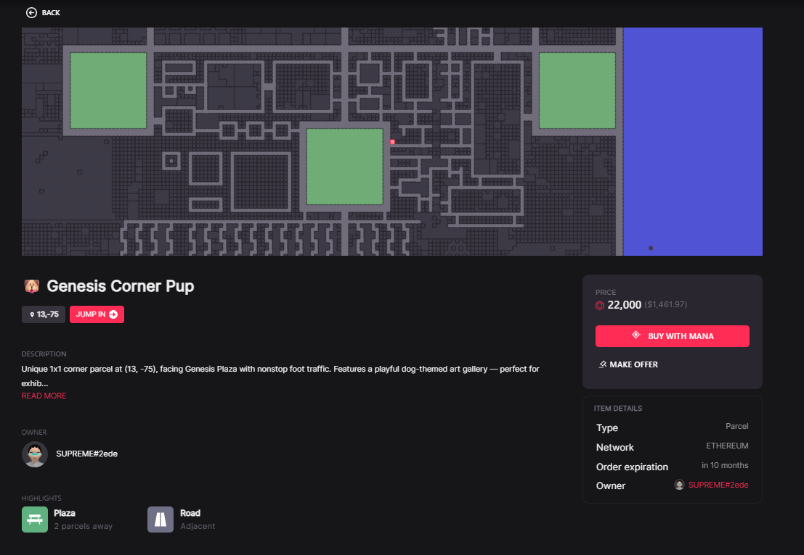

# Mises à jour {.unnumbered}

***04 Août 2026***

- Mise à jour de la section @sec-hypothesis: Hypothèses de recherche
- Mise à jour de la section @sec-decentraland-overview: Présentation du métavers Decentraland
- Rédaction de la section @sec-methodology: Méthodologie

***30 Juillet 2026***

- Création du document


# Introduction

## Contexte et présentation du métavers

Les avancées technologiques en informatique et en cryptographie ont permis l'essor de nouveaux actifs numériques décentralisés quasi inviolables, à savoir les cryptomonnaies et les NFTs. Alors que les premiers sont conçus comme substituts décentralisés aux monnaies classiques, pouvant alors servir comme monnaie d'échange ou canaux d'investissement pour des projets numériques (via des ICO notamment), les seconds représentent des titres de propriété numériques d'un bien (physique ou numérique) tel une oeuvre d'art, un titre foncier, etc... Les cryptomonnaies et les NFT s'appuient sur la technologie blockchain. La blockchain est une base de données décentralisée distributée dans un réseau dont les noeuds sont tous, à importance égale, responsables de la sécurité et de la fiabilité des données via des règles et protocoles mathématiques robustes.

L'essor des cryptomonnaies et des NFT a, au début des années 2020, remis au goût du jour le concept de **métavers**, qui désigne des mondes numériques en 3D immitant le monde réel, tant sur des aspects sociaux (interaction entre individus, création de communautés, communication et partage d'information), que commerciaux (échange/vente de biens et de services, promotion de marques, fidélisation client). Pour les métavers post-NFT, la parcelle de terrain, généralement appelée **LAND**, représente l'actif le plus important: elle permet d'établir une présence dans le monde virtuel, pour y développer des activités sociales et commerciales, à l'exemple des pages ou comptes de réseaux sociaux classiques.

Du potentiel technologique, social et commercial du métavers a découlé des incitatifs de même nature chez divers d'investisseurs d'y établir une présence [@ante2023digital]. Ainsi, les métavers ont connu entre 2019 et 2021 un intérêt croissant considérable. Pour exemple, les volumes de ventes de parcelle du métavers Decentraland, reportés sur la figure @fig-land-sales-volume-ts, témoignent à suffisance du fort intérêt porté vers cet actif en 2021. Le point culminant de cet intérêt global croissant pour le métavers a été le rebranding de Facebook en META, le 28 octobre 2021, suivi des annonces d'investissement de la firme dans des projets de métavers.

```{r fig.width=10, fig.height=4}
#| label: fig-land-sales-volume-ts
#| layout-nrow: 1
#| fig-cap: "Volumes de ventes hebdomadaires de parcelles Decentraland dans le temps<br> Source: Données collectées par les auteurs"
#| warning: false

library(dplyr)
library(tidyr)
library(lubridate)
library(ggplot2)

tmp <- readRDS(file = "transactions.RDS")
p <- tmp |>
  filter(type == "transfer", asset_contract == "0xf87e31492faf9a91b02ee0deaad50d51d56d5d4d", is_sale == T, !is.na(amount_usd)) |>
  select(date, amount_usd) |>
  mutate(week = lubridate::floor_date(date, unit = "week", week_start = 1)) |>
  summarise(
    vol = sum(amount_usd, na.rm=T),
    .by = c("week")
  ) |>
  ggplot(aes(x = week)) +
  geom_line(aes(y = vol), color = "#333", linewidth = 0.7) +
  labs(
    x = "Time (in years)",
    y = "Volume ($ USD)"
  ) +
  theme_minimal()
rm(list = c("tmp"))

p
```


Malgré cet intérêt croissant qui laissait présager un avenir radieux pour le métavers, l'année 2022 a été l'année d'une grose crise des cryptomonnaies, dont de nombreux scandales survenus cette année furent à l'origine: notamment l'effondrement de Terra/Luna et la fraude FTX, pour ne citer que les plus notables d'entre eux. Les cryptomonnaies représentant les principaux canaux d'investissement et d'achat de NFTs, cette crise crypto s'est mécaniquement répercutée sur les NFTs et donc sur les parcelles virtuelles. Les investissement métavers ont chuté et depuis lors, et n'ont plus jusqu'à nos jours jamais retrouvés leur état d'avant 2022.


## Littérature sur le métavers

La littérature actuelle sur le métavers porte essentiellement sur la volarisation des parcelles. Les principaux résultats montre à l'aide de modèles hédoniques de la littérature en économie urbaine réelle l'existence d'une prime de localisation dans la valorisation des parcelles virtuelles.

[@goldberg2024land] décrivant le métavers comme un monde régi par une économie de l'attention, formalisent la valeur d'une parcelle comme dépendante du flux attentionnel qu'elle est capable de capter ou de susciter, ce flux étant lié à sa localisation. Ils montrent ensuite empiriquement que la localisation détermine les prix d'émission des parcelles au lancement du métavers Decentraland, même lorsque l'on tient compte de la téléportation rendue possible dans le monde virtuel. 

[@yencha2023spatial] complémente les résultats de [@goldberg2024land] en y apportant des évidences d'autocorrélation spatiale des prix d'émission, et [@kawai2025anatomy] montrent que dans les marchés sécondaires, les primes de localisation s'aménuisent avec le temps, et atteignent leur minimum global en période de bulle crypto-métavers (2021 et 2022). 

Plusieurs autres études complémentent celles citées ci-dessus:

- [@saengchote2023capitalising] montrent que l'émission de parcelles nouvelles dans le métavers TheSandbox apprécient les prix des parcelles alentours sur les marchés secondaires, apportant l'évidence d'un effet de réseau cohérent avec l'hypothèse d'attention de [@goldberg2024land].
- [@saengchote2022cryptocurrency] établissement une relation causale au sens de Granger entre les prix des cryptomonnaies (largement utilisés comme canaux d'investissement dans les métavers ou monnaie d'échange dans les transactions en parcelles et autres biens du métavers) et les prix de parcelles des métavers Decentraland et TheSandbox.
- [@dowling2021fertile] montre que les marchés secondaires de parcelles de métavers sont inéfficients.

La liquidité reste très peu abordée dans la littérature sur le métavers. [@kawai2025anatomy] dans leur étude sur l'impact de la bulle crypto-métavers de 2021-2022 sur le métavers Decentraland, mettent en évidence le rôle des premiers investisseurs du métavers Decentraland en tant que fournisseurs de liquidité durant la bulle métavers-crypto en 2021-2022. Aucune étude à notre connaissance n'adresse spécifiquement la question de la liquidité des parcelles virtuelles, de sa dynamique spatiale et temporelle. 

Ce double adressage est pertinent car la valeur d'un NFT comporte deux composantes [@schwiderowski2023value]: 

- Une composante intrinsèque tributaire des caractéristiques propres du NFT dont la rareté [@tae2026four; @schwiderowski2023value; @fortagne2023determinants], et l'utilité [@kraussl2023non], 
- Une composante extrinsèque portée par le marché dans lequel il évolue, et dont les déterminants peuvent être le flux informationnel et les frictions de marché [@wilkoff2023behavior], les régimes de marché [@kawai2025anatomy] et les cryptomonnaies associées au métavers [@qiao2023time; @nakavachara2022does; @nakavachara2022metaverse]. 

De plus, la littérature en économie urbaine identifie la localisation et les régimes de marché comme éléments déterminants de la liquidité immobilière ().


## Problématique et contribution

Dans cette note, nous analysons la dynamique de la liquidité des parcelles de métavers, sous l'angle spatial (via la localisation qui représente le principale caractéristique intrinsèque des parcelles en tant que NFTs), et sous l'angle temporel (via les régimes de marché et l'intérêt général porté sur le métavers). Ainsi, la question de recherche à laquelle nous escomptons apporter des réponses est la suivante:

::: {#research-question}
**Comment la localisation influence la liquidité des parcelles virtuelles, et comment cette influence varie dans le temps ?**.
:::

A notre connaissance, l'article de laquelle découlera cette note sera le premier à adresser spécifiquement la question de la liquidité des parcelles virtuelles. Notre contribution à la recherche sur ces marchés émergents, en lien notamment avec la littérature immobilière, est multidimensionnelle.

La microstructure de marché de NFTs est tributaire des caractéristiques intrinsèques (collections, rareté, utilité) et extrinsèques (cryptomonnaies, régime de marché, asymétrie d'information) de ces actifs. Le métavers rajoute une composante spatiale encore non adressée dans la littérature, gap que notre article comble en examinant la composante spatiale de la liquidité des parcelles virtuelles, et son évolution dans le temps via ses interactions avec les régimes de marché et l'intérêt suscité par le métavers.

La littérature en économie urbaine identifie deux canaux d'influence de la localisation sur la liquidité, à savoir les frictions de recherche et l'asymétrie d'information. Ces canaux impliquent une hétérogénéité de la liquidité, par l'existence de dynamiques locales de celle-ci. Dans le métavers, les frictions de recherche sont largement diminués car les annonces de vente de parcelle sont centralisées sur les plateformes de vente. La localisation d'une parcelle à vendre ne détermine pas sa visibilité aux potentiels acheteurs. Les frictions de recherche sont des frictions liées à la plateforme de vente, à l'ancienneté de l'annonce et aux stratégies de promotion des vendeurs. De plus, l'écart informationnel est également grandement diminuée dans le métavers car les caractéristiques des parcelles sont accessibles par tous. L'asymétrie d'information porte plus potentiellement sur des évènements pouvant influencer le marché à l'échelle global plutôt qu'à l'échelle locale ou parcellaire. Ainsi, le métavers constitue un excellent laboratoire d'étude de la liquidité, dans lequel les mécanismes identifiées en immobilier classique ont une moindre voire une insignifiante influence. Le rapprochement des dynamiques de liquidité entre le monde virtuel et le monde réel est pertinent du fait de la proximité des dynamiques de prix déjà établie dans la littérature entre ces deux univers.

En outre, nous étendons les résultats de [@kawai2025anatomy] sur la fourniture de liquidité, en examinant sa relation entre la localisation. Nous adressons plus spécifiquement l'impact de la localisation sur la disponibilité de parcelles sur le marché, à travers la mise sur le marché de parcelles nouvelles et la remise sur le marché des parcelles invendues.


## Hypothèses de recherche {#sec-hypothesis}

Nous examinons la dynamique spatio-temporelle de la liquidité immobilière virtuelle à partir des transactions d'annonce de vente (listings) de parcelle du métavers Decentraland, faites entre 2019 et 2024, via la place de marché officielle dédiée à la vente biens/d'objets Decentraland. Notre analyse est faite sous trois axes:

- **Axe (1):** L'influence de la localisation sur le **taux et la vitesse de vente**, et son évolution dans le temps en fonction des régimes de marché et de l'intérêt général suscité par le métavers. [@goldberg2024land] montrent que la localisation détermine les prix d'émission des parcelles, et [@kawai2025anatomy] montrent que cette influence persiste en marché secondaire au lancement du métavers, et décline dans le temps. Nous faisons l'hypothèse qu'il en est de même pour la liquidité, en régime de marché normal. De plus, le marché des parcelles virtuelles étant inéfficient et sujet à de fortes volatilités [@dowling2021fertile], nous faisons l'hypothèse l'affaiblissement du lien entre localisation et liquidité constaté en économie urbaine [*(Insérer citations)*]{style="color: #FF0000;"}, et celui entre localisation et prix constaté par [@kawai2025anatomy] est encore plus marqué concernant la liquidité. D'autre part, étant donné la nature d'économie d'attention des mondes virtuels postulée par [@goldberg2024land], nous faisons l'hypothèse d'une dépendance de forme convexe entre la localisation et la liquidité. Par ailleurs, la littérature immobilière [*(Insérer citations)*]{style="color: #FF0000;"} met en évidence le caractère inhibiteur de l'attention générale suscitée chez les investisseurs sur la l'influence de la localisation sur la liquidité, nous faisons la même hypothèse pour la liquidité immobilière virtuelle. Ainsi, pour ce premier axe, nous formulons l'es hypothèses suivantes l'hypothèse suivante:
  
  ::: {#hyp-1}
  **H1: La localisation d'une parcelle, représentée par sa distance par rapport au centre du métavers, détermine sa liquidité, représentée par la vitesse et la probabilité de vente de la parcelle**. La relation entre localisation et liquidité possède quatre propriétés:
  
  - **H1-P1**: En régime de marché normal, elle est significative;
  - **H1-P2**: En régime de marché anormal (expansion ou récession), elle est fortement diminuée, voire non significative;
  - **H1-P3**: Lorsqu'elle elle existe, elle est décroissante et convexe;
  - **H1-P4**: Elle est attenué par l'intérêt général suscitée par le métavers lorsque celui-ci est pris en compte;
  :::
  
- **Axe (2)**: L'existence d'une **composante locale de la liquidité**. S'appuyant sur les résultats de [@yencha2023spatial] sur l'existance d'autocorrélation spatiale des prix d'émission des parcelles Decentraland, nous faisons l'hypothèse qu'en plus de l'influence de la proximité aux aménités, la dynamique de marché du voisinage d'une parcelle détermine sa liquidité. Autrement dit, la liquidité comporte une composante spatiale relative, liée au voisinage, en plus d'une composante spatiale absolue, représentée par la proximité aux aménités. Cette hypothèse postule ainsi l'existence d'une microstructure locale du marché immobilier virtuel, caractéristique non observable pour d'autres catégories de NFT, de par leur nature non spatiale. Nous formulons ainsi l'hypothèse suivante:

  ::: {#hyp-2}
  **H2: Il existe une microstructure locale du marché immobilier virtuel: la liquidité est déterminé localement par la dynamique de son voisinage en plus de l'être globalement par la localisation.**
  :::
  
- **Axe (3)**: L'influence de la localisation sur **la fourniture de liquidité dans le marché de parcelles**. Nous postulons que la localisation détermine également l'offre de parcelles sur le marché. [@kawai2025anatomy] mettent en évidence le rôle des pionniers du métavers dans la fourniture de liquidité en période de boom, et les bénéfices globaux engrangés par ceux-ci au détriment des nouveaux arrivants. Cette hypothèse vise à compléter leurs observations, en mettant en évidence le rôle de la localisation dans la fourniture de liquidité et les bénéfices engrangés. De plus, nous postulons également que la localisation détermine la gestion des parcelles invendues, tant sur la remise sur le marché que sur la révision de prix. Nous formulons ainsi l'hypothèse suivante:

  ::: {#hyp-3}
  **H3: La localisation détermine la provision de liquidité immobilière dans le métavers et les bénéfices/pertes des fournisseurs de liquidité.** Trois propriétés de cette double relation sont à noter:
  
  - **H3-P1**: La localisation influence tant la fourniture de parcelles nouvelles sur le marché que la gestion des parcelles présentes et invendues.
  - **H3-P2**: La relation entre localisation et fourniture de liquidité varie selon les régimes de marché: elle est plus marquée en régime normal qu'en régime anormal.
  - **H3-P3**: Une parcelle proche du centre génère plus de bénéfices d'un régime normal à un régime d'expansion, et moins de perte d'un régime d'expansion à un régime de récession. Toutefois, l'ensemble des parcelles excentrées génèrent plus de bénéfices d'un régime normal à un régime d'expansion.
  :::
  
  
## Bref aperçu des résultats

Nos résultats suggèrent premièrement que la localisation, représenté par la distance au centre du métavers, détermine significativement la liquidité mesurée par le temps et la probabilité de vente d'une parcelle. Toutefois, cela est valable uniquement en régime normal, qui correspond à la période de lancement du métavers Decentraland entre 2019 et 2020. A partir de 2021, la dynamique de liquidité se détache de la localisation. De plus, nous montrons que l'intérêt général suscité par le métavers inhibe l'effet de la localisation sur la liquidité, quelque soit la période temporelle observée. Par ailleurs, lorsque l'acheteur souhaite renégocier le prix d'annonce, les parcelles éloignées du centre font le plus l'objet de demande de rénégociation, ont le plus faible écart de prix de rénégociation, mais ne sont pas plus liquides après renégociation que les parcelles proches du centre. Ce dernier résultat suggère que l'effet de la localisation sur la liquidité est très faiblement altérée par la capacité de renégociation de prix des acheteurs.

De plus, nos résultats suggère que la liquidité, en plus d'être globalement déterminé par la localisation d'une parcelle, est également localement déterminée par le voisinage de celle-ci. En effet, indépendamment de la proximité d'une parcelle aux aménités du métavers, l'appartenance de celle-ci à un voisinage dynamique (forte disponibilité sur le marché forte liquidité passée de parcelles alentours) apprécie sa liquidité. Contrairement à ce qu'impliquerait la faible prégnance des frictions de recherche et de l'écart informationnel dans le métavers, la liquidité n'est pas homogène, mais comporte une composante locale. Ce résultat, bien que issu de transactions en marché secondaire, est cohérent à ceux de [@yencha2023spatial] sur les prix en marché primaire. 

Enfin, nos résultats sur la disponibilité des parcelles sur le marché suggère que la localisation est indépendante de l'offre de parcelles sur le marché en régime normal, et dépendante pour tous les autres régimes. La remise sur le marché des parcelles invendues et la révision de prix de ces dernières apparait fortement liée à la localisation principalement durant les régimes d'expansion et de récession entre 2021 et 2022, témoignant du fait que l'intérêt culminant suscité par le métavers, et le crash qui s'en est suivi se sont répercutés sur le comportement des vendeurs de parcelles.

<!--Les parcelles excentrées apparaissent plus disponibles en régime d'expansion en 2021, car les premiers investisseurs les vendent préfèrent plus les vendre (que les parcelles proches du centre) aux nouveaux entrants. En régime de crash en 2022, le disponibilité de parcelles reste plus notable pour les parcelles excentrées car en période de crash, ce sont elles qui, vraisemblablement selon les investisseurs, perdraient le plus de valeur; d'où l'urgence de s'en débarasser.--> <!--La remise sur la marché des parcelles invendues est quant à laquelle dépendante de la localisation uniquement en régime normal et en régime de récession. En cas non vente, les parcelles excentrées sont moins fréquemment remises sur le marché en régime normal, et plus fréquemment en période de crash, ce qui reste cohérent avec les résultats sur la disponibilité. De plus, les parcelles proches du centre remises sur le marché sont plus fortement décôtées car *surpricées*, sauf en régime désert à partir de 2023, où elles le sont moins fortement. Une-->

<!--Les parcelles de métavers sont des NFTs avec une structure spatiale, dont la rareté est liée à la proximité aux principales aménités du métavers. Les résultats de notre analyse empirique, effectuée à partir des annonces de vente de parcelles Decentraland via la marketplace officielle du métavers, révèlent une microstructure spatiale du marché. En effet, nous montrons qu'au déla de la simple liaison entre la liquidité et la localisation d'un point de vue global dans le métavers, la liquidité est également localement déterminé: .-->


# Présentation du métavers Decentraland {#sec-decentraland-overview}

Nous examinons les hypothèses [H1](#hyp-1), [H2](#hyp-2) et [H3](#hyp-3) formulées ci-dessous sur les données transactionnelles du métavers Decentraland [@ordano2017decentraland]. Decentraland est le premier métavers s'articulant autour de la blockchain et des NFTs. Annoncé en 2017, il n'a rééllement été lancé que le 20 février 2020, après deux campagnes d'émission de parcelles virtuelles en Mars et Novembre 2018. En Octobre 2018, la marketplace officielle du métavers voit le jour, permettant aux investisseurs, bien que le monde virtuel n'était pas encore achevé, de s'échanger des parcelles et autres objets du métavers.


## Géographie du métavers

La géographie de Decentraland en fait un monde de forme presque carrée, composé d'un peu plus de 300 parcelles de côté, pour un total de 92 576 parcelles. 48 096 d'entre elles y abritent les principales aménités du métaversé, tandis que les parcelles restantes sont destinées à un usage privé pour les personnes qui en ont le droit le propriété. 

::: {#fig-decentraland-map}

{width=600}

*Source: [Binance](https://www.binance.com/ar/square/post/274542)*

:::

La figure @fig-decentraland-map illustre la disposition des parcelles et aménités du métavers Decentraland. Nous avons:

- Les **plazas** en **blanc**, dont une centrale et huit disposées tout autour de la carte, sur les points cardinaux et les diagonales. Les plaza sont les principaux lieux de socialisation et carrefours d'activités pour les utilisateurs dans le métavers. Le plaza central est particulièrement plus important que les autres, car c'est le point d'arrivée par défaut de toute nouveau visiteur dans le métavers.
- Les **routes** en **noir**, sont les axes de circulation dans le métavers. L'exploration dans le monde virtuel peut fait à pied ou via un tramway faisant le tour du monde virtuel, bien qu'il soit également possible de se téléporter d'un point à un autre dans Decentraland.
- Les **districts** en **bleu**, qui désignent des groupes de parcelles rassemblées autour d'un thème ou d'une communauté. En somme, les districts sont des quartiers thématiques ou communautaires dans le métavers. Ces quartiers ne sont pas à vendre et possèdent leurs propres règles de gouvernance. Ils ont été à la suite de proposition soumises par des utilisateurs et validées ensuite par l'instance de gouvernance du métavers.

Le reste de parcelles, en **vert**, sont des parcelles à usage privée, s'échangeant sur les marchés immobiliers virtuels. Chaque parcelle dans le métavers est identifiée par ses coordonnées cartésiennes $(X,Y)$, qui renseignent sur sa position exacte sur la carte.

Le détenteur d'un ensemble de parcelles juxtaposées peut les combiner de manière à former un *unique* bien immobilier à partir de ces parcelles: il s'agit d'un **domaine** ou **estate**. Les domaines, à la différence des parcelles, se distinguent donc en plus de leurs localisations, par leurs tailles (nombre de parcelles desquelles elles sont constituées). Les domaines s'échangent également en marché secondaire. Nous intégrons les domaines à notre analyse à des fins de robustesse.


## Marché immobilier du métavers {#sec-virt-immo-market}

Le marché primaire des parcelles Decentraland regroupe les émissions de parcelles réalisées en Mars et Décembre 2018. A partir d'octobre 2018, Decentraland, les possesseurs de parcelles et les personnes désireuses d'en acquérir se sont vus offrir la possibilité d'échanger entre eux des parcelles, et d'autres objets Decentraland via une plateforme dédiée, que nous désignerons par la suite par DclMarketplace. Sur cette plateforme, les détenteurs de parcelles peuvent poster des annonces de vente de parcelle. La figure @fig-dcl-land-listing illustre la page d'annonce d'une parcelle listée.

::: {#fig-dcl-land-listing}

{width=600}

*Source: [Dcl Marketplace](https://decentraland.org/marketplace/contracts/0xf87e31492faf9a91b02ee0deaad50d51d56d5d4d/tokens/4763953136893138488487244504044754960309)*
:::

On peut y voir les coordonnées de la parcelle à vendre accompagnée d'une image illustrant la position de la parcelle sur la carte du métavers, le prix demandé par le vendeur, une description de la parcelle, ses avantages de proximité aux aménités (plaza, route, district), la date d'expiration de l'annonce de vente et les coordonnées du vendeur.

En plus de Dcl Marketplace, les investisseurs peuvent s'échanger des parcelles via des marketplaces externes à Decentraland. Il s'agit de plateformes spécialisées dans l'échange de NFTs entre pairs, dont les plus populaires sont [Opensea](https://opensea.io), [Rarible](https://rarible.com) et [LooksRare](https://looksrare.com). Comme le montre la figure @fig-land-sales-volume-2nd-ts, DCL Marketplace domine en termes d'activité transactionnelle jusqu'en 2022. A partir de 2022, les ventes de parcelles sont majoritairement faites via les marketplaces externes.

```{r fig.width=10, fig.height=4}
#| label: fig-land-sales-volume-2nd-ts
#| layout-nrow: 1
#| fig-cap: "Volumes de ventes hebdomadaires de parcelles Decentraland en marchés secondaires<br> Source: Données collectées par les auteurs"
#| warning: false

library(dplyr)
library(tidyr)
library(lubridate)
library(ggplot2)

tmp <- readRDS(file = "transactions.RDS")
p <- tmp |>
  filter(type == "transfer", asset_contract == "0xf87e31492faf9a91b02ee0deaad50d51d56d5d4d", is_sale == T, !is.na(amount_usd)) |>
  select(date, amount_usd, sale_related_market) |>
  filter(sale_related_market %in% c("dcl-marketplace-1", "dcl-marketplace-2", "third-party-marketplace")) |>
  mutate(
    week = lubridate::floor_date(date, unit = "week", week_start = 1),
    month = lubridate::floor_date(date, unit = "month"),
  ) |>
  summarise(
    vol_dcl = sum(amount_usd[which(sale_related_market %in% c("dcl-marketplace-1", "dcl-marketplace-2"))], na.rm=T),
    vol_3pm = sum(amount_usd[which(sale_related_market %in% c("third-party-marketplace"))], na.rm=T),
    .by = c("month")
  ) |>
  mutate(
    vol_diff = vol_dcl - vol_3pm
  ) |>
  ggplot(aes(x = month)) +
  geom_line(aes(y = vol_diff), color = "#333", linewidth = 0.7) +
  labs(
    x = "Time (in years)",
    y = "Vol DCL Mkp - Vol Autres Mkps ($ USD)"
  ) +
  theme_minimal()
rm(list = c("tmp"))

p
```

Des figures @fig-land-sales-volume-ts et @fig-land-sales-volume-2nd-ts, il se dégage quatre grandes phases ou moments qui caractérisent les marchés secondaires Decentraland, et auxquelles correspondent quatre régimes de marché:

- La **phase 1**, ou **lancement du métavers**, qui correspond à un régime de marché normal. Cette phase s'étend de 2018 à 2020, et est caractérisée à un légère croissance de l'activité transactionnelle. La métavers est nouveau, les premiers investisseurs arrivent et acquièrent des parcelles soit sur le marché primaire soit sur le marché secondaire. Au lancement du monde virtuel en février 2020, la croissance des investissements devient légèrement plus marquée.
- La **phase 2**, ou **boom crypto-métavers**, qui correspond à un régime d'expansion forte. Cette phase s'étend sur toute l'année 2021 et est caractérisée par une hausse substantielle des investissements dans Decentraland. Les volumes de ventes en mars 2021 sont multipliés par 10 par rapport à ceux de 2020, et ceux d'octobre 2021 sont multipliés par plus de 80. Cette période est aussi caractérisée par une hausse générale du marché crypto et NFT [*(Insérer citations)*]{style="color: #FF0000;"}.
- La **phase 3**, ou **crash crypto-métavers**, qui correspond à un régime de récession forte. Cette phase s'étend sur toute l'année 2022 et est caractérisée par une chute spectaculaire des investissements dans le métavers, des prix des parcelles, et des cryptomonnaies et NFT en général. C'est la période d'éclatement de la bulle crypto-nft-métavers.
- La **phase 4**, ou **période déserte du métavers**, qui correspond à un régime de récession faible. Cette phase s'étend de 2023 jusqu'à nos jours. Elle prolonge, avec néanmoins une amplitude beaucoup plus faible, la tendance baissière de la phase précédente. La population et les investisseurs désertent le métavers, ce dernier semblant redevenir une niche pour passionnés.


# Méthodologie {#sec-methodology}

## Temps sur le marché et conversion en vente

Nous examinons la liquidité immobilière virtuelle par la vitesse et le probabilité de vente d'une parcelle listée sur le marché. Pour cela, nous collectons les annonces de ventes de parcelles Decentraland. La liquidité immobilière se caractérisant comme étant la survenue d'un évènement (vente) au bout d'un certain temps (temps sur le marché), nous la modélisons par des modèles de survie et de hasard, largement employées en littérature immobilière pour modéliser le temps sur le marché [@kluger1990measuring; @yilmaz2022rental; @cajias2020exploring] ou le risque de défaut sur les prêts immobiliers [@Arents2019Survival; @Peng2026Incorporating; @Yolanda2020ANALISIS].

Contrairement aux modèles de régressions linéaires et logistiques classiques, ces modèles formalisent la probabilité de survenue d'un événement en tenant compte de cas de censure, qui désignent les observations pour lesquelles l'événement n'a pas eu lieu (non vente). Ces modèles possèdent plusieurs formalismes, dont deux d'entre eux en particulier sont plus que pertinents dans notre contexte. Le premier est le modèle à temps accéléré (Accelerated Failure Time) ou AFT [@kalbfleisch2002statistical], qui postule que les variables d'intérêt agissent sur le temps de survenue de l'événement en l'accélérant (effet contractif) ou en le ralentissant (effet dilatatif). Le formalisme AFT est approprié pour modéliser le temps sur le marché d'une parcelle vendue. 

$$
\begin{align}
&\Lambda (t | \theta) = \theta . \Lambda_0 (\theta . t) \\
&\theta = exp \left[ - X'\beta \right] \\
&X = (X_1, \dots, X_k) \text{ et } \beta = (\beta_1, \dots, \beta_k)
\end{align}
$$ {#eq-aft-model}

L'équation @eq-aft-model illustre le formalisme AFT. L'effet des variables d'intérêt agit directement sur le temps de survenue de l'événement. Par exemple, $\theta = 2$ signifie une accélération de temps deux fois plus rapide que la normale, et donc un temps espéré de survenue de l'événement égal à la moitié du temps espéré normal. De manière générale, $\beta_i > 0$ implique $\theta \downarrow$, ce qui traduit une dilatation ou un ralentissement du temps. Inversément,  $\beta_i < 0$ implique $\theta \uparrow$, ce qui traduit une contraction ou une accélération du temps.

Le second formalisme est celui de Cox [@cox1975partial], encore appelé modèle à risques proportionnels, qui modélise la probabilité (ou risque) instantanée de survenue de l'événement à un temps $t$, sachant qu'il n'a pas eu lieu. Le modèle de Cox est décrit par l'équation @eq-cox-model:

$$
\begin{align}
&\Lambda (t | \theta) = \Lambda_0 (t) . exp \left[ X'\beta \right]  \\
&X = (X_1, \dots, X_k) \text{ et } \beta = (\beta_1, \dots, \beta_k)
\end{align}
$$ {#eq-cox-model}

Les coefficients $\beta_i$ renseignent sur l'influence des variables d'intérêt sur la probabilité instantannée de survenue de l'événement. Lorsque $\beta_i > 0$, la variable $X_i$ a un effet positif sur cette probabilité, et inversément, lorsque  $\beta_i < 0$, la variable $X_i$ a un effet négatif sur cette probabilité. Le modèle de Cox est précisément adapté à la modélisation de la probabilité de vente d'une parcelle.

Les variables d'intérêt $X_i$ regroupent les variables de localisation, les indicatrices de périodes temporelles et de régimes de marché, les variables d'attention globale suscitée par le métavers, et les variables de microstructure locale de marché.

La distance d'une parcelle à la plaza centrale, désignée comme le centre du métavers, constitue la variable principale de la dimension spatiale de la dynamique de la liquidité immobilière virtuelle dans notre analyse La proximité aux autres aménités (plaza périphérique le plus proche, route la plus proche, district le plus proche) permettent de contrôler l'effet de la distance au centre. Ces variables de proximité sont construites sous forme d'indicatrices égales à 1 lorsque la distance à l'aménité est inférieure à 10 parcelles, valeur obtenue par [@goldberg2024land] comme seuil implicite de téléportation.

Les indicatrices de périodes temporelles et de régimes de marché constituent les variables d'intérêt de la dimension temporelle de la dynamique de la liquidité immobilière virtuelle dans notre analyse. Ainsi, nous intégrons dans notre modélisation de la liquidité des effets fixes trimestriels, et des effets d'intéraction entre chaque indicatrice de régime de marché et les autres variables d'intérêt.

Les variables de microstructure locale sont définies à partir d'un voisinage de la parcelle en vente. Nous définissons deux structures de voisinage: 

- un voisinage équivalent aux parcelles situées dans un rayon de 10 parcelles autour de la parcelle en vente, en excluant cette dernière (correspondant à un maximum de 95 parcelles $\frac{\pi}{4} \times (11^2-1) \simeq 94.25$), 
- un voisinage équivalent aux 50 parcelles les plus proches de la parcelle en vente. 

Dans ces voisinages, nous définissons la microstructure locale par:

- La dynamique actuelle du marché dans la voisinage, mesurée par nombre de listings en cours et l'intérêt d'achat actuel suscitée chez les investisseurs, 
- La liquidité passée du marché local mesurée par le taux de vente et le temps sur le marché des parcelles voisines vendues dans les 30 derniers jours précédant le listing de la parcelle en vente. 

La littérature immobilière supporte empiriquement l'existence de microstructure locale affectant la liquidité immobilière. [@turnbull2006spatial] et [@Cirman2015Determinants] montrent que la concurrence locale, mesurée par la densité de listings voisins, affecte la liquidité immobilière, avec des effets variants selon les segments de marché. [@Loberto2020What] montrent que l'intérêt d'achat prédit la liquidité immobilière future, et [@VanDijk2020The] documentent que les indices de demandes d'immobilier commercial déterminent les prix et les volumes de transactions. De plus, [@Pilat2025Strategic; @Hattapoglu2020Hot; @Sobieraj2024Machine] montrent que le temps sur le marché et le taux de vente passées du voisinage local déterminent la liquidité actuelle.

La spécification des variables d'intérêt $X'\beta$ s'écrit finalement suivant l'équation @eq-regs-spec:

$$
\begin{align}
X'\beta = \sum_{r \in \text{Régimes}} \left[ \beta_{0,r} + \beta_{loc,r} X_{loc,i} + \beta_{loc.att,r} (X_{loc,i} \times X_{att,t}) + \beta_{micro,r} X_{micro,it} +
\beta_{ctrl,r} X_{ctrl,i} + \lambda_{tr} + \epsilon_{itr} \right] \times \mathbb{1}_{r}
\end{align}
$$ {#eq-regs-spec}

où $X_{loc}$ désigne la variable de localisation, $X_{att}$ désigne les variables d'attention générale suscitée par le métavers, $X_{micro}$ désigne les variables de microstructure locale, $X_{ctrl}$ désigne les variables de contrôle, $\lambda_{tr}$ désigne les effets fixes trimestrielles régimes-dépendants, et $\mathbb{1}_{r}$ désigne l'indicatrice de régime. Les variables de contrôle incluent les indicatrices de proximité aux autres aménités et les prix de demande des parcelles listées.

La convexité du lien entre localisation et liquidité est examinée en appliquant les modèles AFT et Cox sur chaque décile de distance au centre, avec une attention particulière portée sur les premiers déciles, et la progression des coefficients de régressions en fonction des déciles.


## Provision de liquidité et bénéfices

Nous distinguons deux modalités de provision de liquidité. Une première modalité indépendante du motif du détenteur de la parcelle, et une seconde motivée par l'échec de vente du listing précédent, cette dernière témoignant plus d'une urgence/nécessité pour le vendeur de liquider la parcelle.

Nous examinons la première modalité par des regréssions logistiques à effets fixes hebdomadaires et régime-dépendants, sur l'ensemble des parcelles detenues en début de régime. Le choix des effets fixes hebdomadaires plutôt que trimestriels est motivé par les temps sur marché très courts des parcelles virtuelles (voir figure @fig-), permettant ainsi de limiter la quantité de parcelles mises sur le marché plusieurs fois au cours d'une période. En plus de la proximité aux autres aménités, nous intégrons comme variables de contrôle la taille du portefeuille du détenteur de la parcelle, et son rendement de détention de la parcelle. Ces deux variables ont une importance particulière car elles renseignent sur l'urgence pour le vendeur à vendre la parcelle, selon l'hypothèse que plus le vendeur est pressé pour vendre la parcelle, plus celle-ci sera plus souvent sur le marché.

Concernant la seconde modalité de provision de liquidité, nous prenons comme base l'ensemble des listings de parcelles ayant échoué à se vendre, et estimons de celle-ci la probabilité de remise sur le marché et la révision de prix appliquée en cas de prix révisé. Nous estimons la probabilité de remise sur le marché par des régressions logistiques, et la révision de prix par des régressions linéaires, et nous contrôlons pour la proximité aux autres aménités, la taille du portefeuille du vendeur, le rendement de détention de la parcelle, le temps sur le marché du listing échoué, et une indicatrice d'intention d'achat par de potentiels acheteurs. L'avant-dernière variable témoigne à la fois de l'ampleur de l'échec et de l'urgence pour le vendeur à vendre vite sa parcelle, et la dernière renseigne sur l'intention d'achat à un prix inférieur au prix demandé. Plus le temps sur marché précédent est long, moins le vendeur sera incité à remettre une pièce dans la machine, et plus la parcelle est sollicité par des acheteurs, plus le vendeur sera incité à la remettre sur le marché, potentiellement à un prix décotté. 

Pour évaluer les effets de la localisation sur le bénéfice de vente des parcelles, nous régressons le rendement de vente des parcelles sur la localisation, en contrôlant pour la proximité aux autres aménités, les trimestres d'acquisition et les trimestres de ventes. En guise de robustesse, nous examinons deux spécifications de ces régressions: une libre et une régime-dépendante. La première nous permet d'obtenir des effets de localisation indépendants des régimes, et la seconde des effets régimes-dépendants plus subtils. 


# Données

[*En cours de rédaction...*]{style="color: #0000FF;"}


# Résultats

[*En cours de rédaction...*]{style="color: #0000FF;"}


<!--Cette hypothèse est cohérent avec [@benedek2025asymmetries] et [@aharon2022nfts] qui montrent que les caractéristiques intrinsèques des NFT sont dominés par les caractéristiques extrinsèques en période agitée dans la détermination de la dynamique de marché.

En économie urbaine, les périodes agitées (boom ou crise) n'annulent pas les effets de la loc sur la liq

Cette convexité marquée supposée contraste avec la quasi linéarité observée en économie urbaine, et se déduit de la convexité entre attention et localisation vs quasi-linéarité entre frictions de recherche et localisation.

-->


# Réferences {.unnumbered}

::: {#refs}
:::


